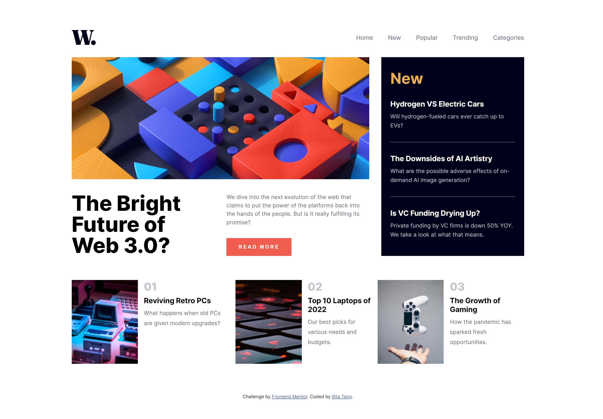
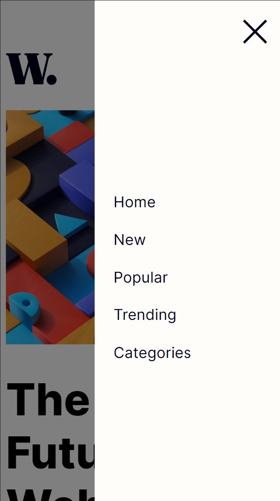

# Frontend Mentor - News homepage solution

This is a solution to the [News homepage challenge on Frontend Mentor](https://www.frontendmentor.io/challenges/news-homepage-H6SWTa1MFl).  

## Overview

The challenge is to build out the project and get it looking as close to the designs inside the `/design` folder as possible. Required assets are stored in the `/images` folder. Users should be able to:

- View the optimal layout for the interface depending on their device's screen size
- Toggle the mobile menu

### Screenshot

- Desktop View

  

- Mobile View

  
  

### Links

- Solution URL: [Here](https://github.com/ritatanght/news-homepage/)
- Live Site URL: [Here](https://ritatanght.github.io/news-homepage/)

### Built with

- Semantic HTML5 markup
- CSS custom properties
- Javascript
- Flexbox
- CSS Grid

### What I learned

Originally setting the mobile menu as {position : absolute}, it is still visible by dragging to the side even with {overflow-x : hidden}. Setting the {position : fixed} solved the problem.

### Useful resources

- [How TO - Overlay](https://www.w3schools.com/howto/howto_css_overlay.asp/) - This helped me create the overlay for the menu in the mobile view. 
- [How TO - Curtain Menu](https://www.w3schools.com/howto/howto_js_curtain_menu.asp/) - This taught me another way to create a slide-in effect is to toggle the width/height of the overlay/menu.